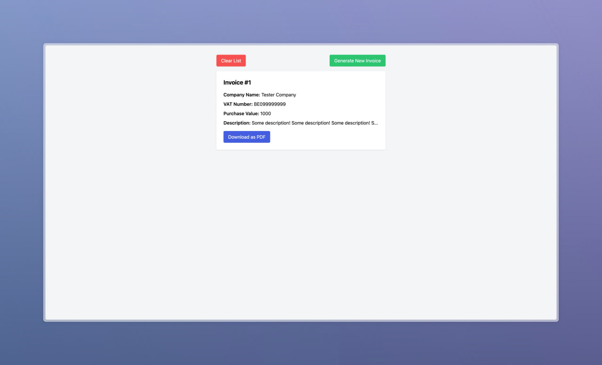

# React Invoice Form with Zod Validation and Server Actions

## Project Overview

This project is a React application that utilizes React Hook Forms for form management and Zod for schema validation. It features server actions for generating invoices, which can be downloaded as PDFs and stored in the local storage.

The main page displays a list of previously created invoices with options to download each as a PDF. Additionally, there are two buttons: one to clear the list and another to create a new invoice.

## Creating a New Invoice

By clicking on "Create New Invoice," users are presented with a form to input details such as Company Name, VAT Number, Purchase Value, and Description. Upon submission, the form data is validated using Zod. If no errors are found, the user is redirected back to the main page where the new invoice is now listed.

## Project Structure

The project is organized into the following directories within the `app` folder:

- `./app/invoice_generator`: Houses the invoice generation logic.
- `./app/invoice_generator/saveInvoices.ts`: Functions to save invoice data to local storage.
- `./app/invoice_generator/page.tsx`: The main page component that displays the invoice list.
- `./app/action.ts`: Server actions for invoice processing.
- `./app/layout.tsx`: The layout component for the application.
- `./app/page.tsx`: A generic page component.

## Types and Validation

The `./lib/types.ts` file defines the schema for an invoice and its associated data types using Zod.

## PDF Generation

The `./lib/downloadPDF.ts` module utilizes jsPDF to generate downloadable PDFs from invoice data.

## How to Use

1. Clone the repository.
2. Install dependencies with `npm install` or `yarn install`.
3. Start the development server with `npm start` or `yarn start`.
4. Navigate to the main page to view existing invoices or create a new one.

## Contributing

Contributions to improve the project are welcome. Please follow the standard fork and pull request workflow.
